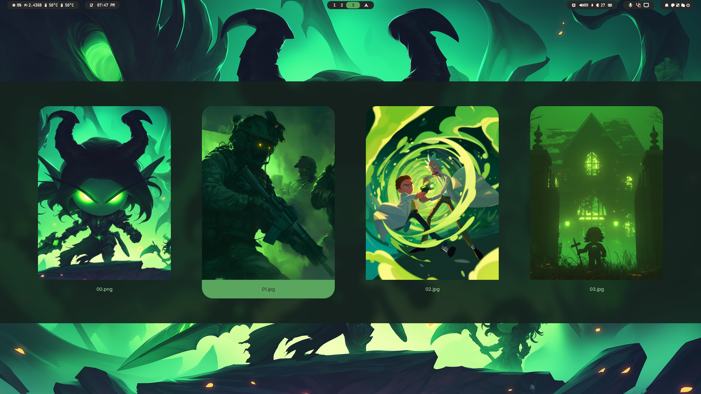
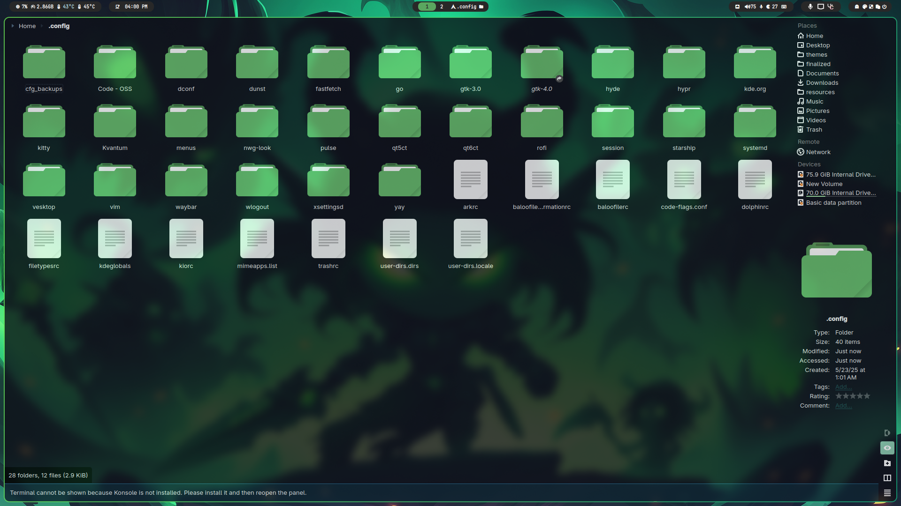

# LimeFrenzy

<div align="center">
    <a href="https://discord.gg/AYbJ9MJez7">
            
    </a>
</div>
<div align="center"><br><br></div>

> **IMPORTANT**
> This is not a standalone theme, it requires [HyDe](https://github.com/Hyde-project/hyde) to be installed.




## Installation

To install **LimeFrenzy** theme, run the following command:

```sh
Hyde theme import "LimeFrenzy" https://github.com/xaicat/LimeFrenzy
```
Alternatively, you can import the theme by running:

```sh
Hyde theme import
```

Then choose LimeFrenzy from the options.
